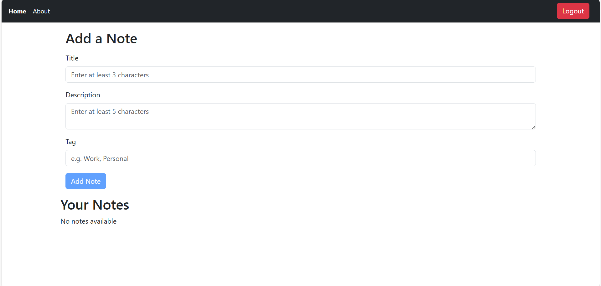
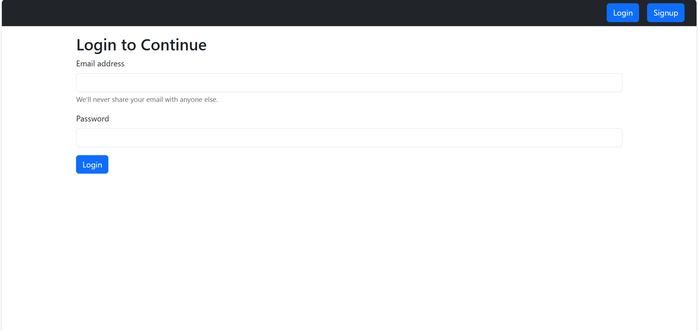

# Notes App 📒

This is a **MERN stack notes application** where users can:
- ✍️ Create, read, update, and delete notes  
- 🔐 Signup and Login securely with JWT authentication  
- ⚡ Manage their notes in a clean and simple interface  

## Features 🚀
- User authentication (Signup/Login)  
- Add, edit, and delete personal notes  
- Responsive UI with React & Bootstrap  
- Backend powered by Node.js, Express, and MongoDB  

## Screenshots 📸
Here are some screenshots of the app:

### 🏠 Home Page


### 🔑 Login Page



## Tech Stack 🛠️
- **Frontend:** React, Bootstrap, Context API  
- **Backend:** Node.js, Express.js  
- **Database:** MongoDB  
- **Authentication:** JWT  

## Installation ⚙️
1. Clone the repository  
   ```bash
   git clone https://github.com/MUSA-apnacollege/iNotebook.git

cd notes-app
npm install
cd backend
npm install

npm run both
